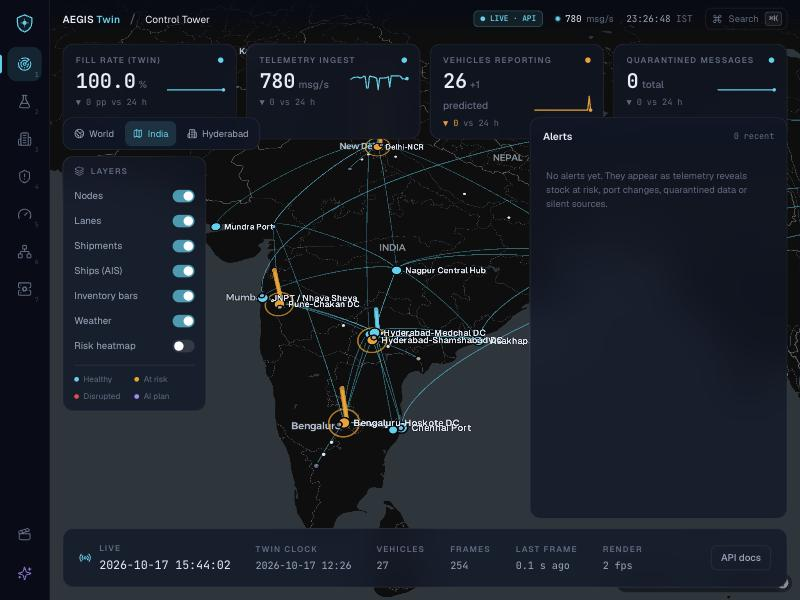
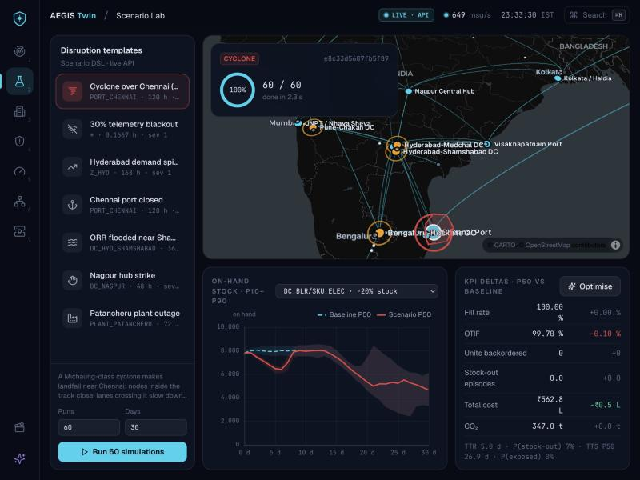

# Phases 4 and 5 — Backend platform, ingestion and the live frontend

**AEGIS Twin · Days 5–11 · critical path** · status: **done** (30 Sep 2026)

Phase 4 exit: *the Reality Emulator → ingest → twin → WebSocket pipeline works, and `wscat` shows live diffs.* Phase 5 exit: *the Control Tower runs on live data; Scenario Lab v1 runs real what-ifs.*

| Criterion | How | Result |
|---|---|---|
| §7 schema via Alembic; telemetry as a Timescale hypertable with compression | `cd services/api && alembic upgrade head` | ✅ 17 tables (+ `schema_info`), PostGIS geography nodes. The hypertable + compression path runs whenever the `timescaledb` extension is loadable; on this laptop it is not installed, so the migration fell back to `plain+brin` (see *TimescaleDB* below) |
| Ingest `POST /api/v1/ingest/{telemetry\|inventory\|supplier}` + `WS /api/v1/ingest/stream`, HMAC, strict validation, XADD `telemetry.raw` | `tests/test_api.py` | ✅ unknown publisher, bad signature, tampered body, stale timestamp and replayed nonce → 401. Layer-1 reason codes (`SCHEMA_MISSING / RANGE / TYPE / EXTRA / KIND / ENVELOPE`) |
| ≥ 5,000 msgs/s with batching + orjson (NFR-1) | `python -m services.api.loadtest` | ✅ **27,307 msgs/s** at the gateway (p95 202 ms per 500-message batch); **10,288 msgs/s end to end** through trust, twin state and Postgres COPY. One uvicorn process, 8-core Apple silicon ([`loadtest.json`](loadtest.json)) |
| Twin-state service: `telemetry.clean` → Redis hashes, NetworkX attributes, batched Timescale/Postgres writes | live run + tests | ✅ `veh:{id}`, `inv:{node}`, `port:{id}` hashes; `stock_<sku>` / `status` node attributes; COPY every second |
| `WS /ws/live` msgpack diffs at 5–10 Hz; `WS /ws/scenarios/{id}` progress | `wscat -c ws://localhost:8000/ws/live?format=json` | ✅ snapshot, then diffs (vehicle upserts/removals, inventory, ports, alerts, KPIs once a second) |
| REST, RBAC, health, metrics | `/docs` | ✅ `/network`, `/nodes/{id}`, `/shipments`, `/kpis`, `/scenarios…`, `/plans/{id}/apply` (planner), `/chaos/inject` (**admin only**: 401/403 tested), `/trust/*`, `/eval/*`, `/healthz`, `/readyz`, `/metrics` |
| Scenario jobs in a worker pool, spec-hash cache | Scenario Lab | ✅ 100 reps × 30 days in **3.3 s** with streamed progress; a repeated what-if comes back from Redis in **≈ 5 ms** |
| Emulator → ingest → twin → WS, live | `sim.reality.run --http … --realtime 60` | ✅ ≈ 550–700 msgs/s at demo pace; **0 false quarantines in 57,015 messages**; an injected GPS teleport was caught (exactly its 3 pings, L4) |
| Phase 5: design system, globe map shell + WORLD → INDIA → HYDERABAD presets, live Control Tower, Scenario Lab v1, 60 fps interpolation | browser | ✅ below |
| Tests | `python -m pytest` | ✅ **81 passed** (+ 3 slow) |

---

## Architecture (as built)

```
Reality Emulator ──HMAC batches──► POST /api/v1/ingest/{channel} ──┐     WS /api/v1/ingest/stream ──┐
   (sim.reality.run --http)                                        ▼                                ▼
                                        layer 1: strict schema ── reject ──► quarantine stream + DB
                                                    │ accept (pipelined XADD, orjson)
                                                    ▼
                                           Redis Stream telemetry.raw ── consumer group "trust"
                                                    │ L2 device HMAC · L3 dedupe / replay / stale · L4 physics
                                                    ▼
                                           Redis Stream telemetry.clean ── consumer group "twin"
                                                    │
               ┌──────────────── twin-state stage ─┴───────────────┐
               ▼                        ▼                           ▼
     live state (in memory)     Redis hashes veh/inv/port     Postgres COPY (telemetry, inventory, quarantine)
               │                  NetworkX node attributes
               ▼
     WS /ws/live broadcaster (5–10 Hz msgpack diffs, per-client queue, drop-oldest backpressure)

 Live macro twin (SimPy RealtimeEnvironment, own thread) ── KPIs, reorder points, plan actions
 Scenario service ── ProcessPoolExecutor (spawn) ── Monte Carlo chunks ── Redis cache sha256(spec, n) ── WS progress
```

All of this is one FastAPI process (a modular monolith, ADR-0001). The consumer groups already allow several trust and twin-state workers; Phase 10 splits them into containers.

| Module | File |
|---|---|
| Settings (env) | `services/api/app/config.py` |
| §7 models, Alembic, TimescaleDB switch | `services/api/app/db/models.py`, `migrations/versions/0001_initial.py`, `db/timescale.py` |
| Seeding, batch COPY writer, audit | `services/api/app/db/store.py` |
| Ingest gateway | `services/api/app/ingest.py` |
| Trust + twin-state stages, SLA monitor | `services/api/app/pipeline.py` |
| Live state + alerts | `services/api/app/live_state.py` |
| Live twin thread | `services/api/app/live_twin.py` |
| WebSocket fan-out | `services/api/app/ws.py` |
| Scenario jobs, optimise, apply | `services/api/app/scenarios.py` |
| REST, chaos, trust / eval read models, ops | `services/api/app/routes.py` |
| Roles | `services/api/app/auth.py` (bearer tokens → viewer < planner < security < admin; JWT in Phase 8) |
| Load test | `services/api/loadtest.py` |

### TimescaleDB

The migration calls `db/timescale.enable()`. When the `timescaledb` extension can be created (it must be in `shared_preload_libraries`):

- `telemetry` and `inventory` become hypertables with 1-day chunks.
- Native compression is on (segment by vehicle, or by node × SKU; order by `ts desc`).
- `add_compression_policy(… interval '2 days')` is set.
- `schema_info.timeseries_mode` records `timescale`.

Otherwise both tables stay plain tables with a BRIN index on `ts` plus the `(entity, ts desc)` btree, and the mode is `plain+brin`.

This laptop has Homebrew Postgres 17 + PostGIS but not TimescaleDB. Installing it needs the third-party `timescale/tap`, which Homebrew only loads after an explicit `brew trust`. That trust decision was left to the machine's owner. To enable it later:

```bash
brew trust timescale/tap && brew install timescale/tap/timescaledb && timescaledb-tune --quiet --yes
```

```bash
brew services restart postgresql@17 && .venv/bin/python -m services.api.app.db.timescale
```

The second command converts the existing tables in place (`migrate_data => true`). `docker-compose.yml` uses the `timescale/timescaledb-ha:pg17` image, so the Docker path gets hypertables from the first migration. The Compose file was written without Docker available to test it; the same services run natively as shown below.

### Trust stage (Phase 4 core)

| Layer | Check | Reason |
|---|---|---|
| L1 (gateway) | Pydantic strict envelope + typed payload, finite numbers, ranges, kind ↔ channel | `SCHEMA_*` |
| L2 | per-device HMAC (key = HMAC(master, source_id)) | `HMAC_INVALID` |
| L3 | msg_id seen before (Redis `SET NX`, 1 h) · older than the source's last message by > 60 s or > 1 h behind the world clock | `DUPLICATE_ID` · `STALE_TS` |
| L4 | GPS jump implying > 200 km/h. The track is re-anchored after 10 self-consistent fixes, longer than any teleport attack, so one bad jump can't lock a vehicle out | `PHYSICS_TELEPORT` |
| L9 (SLA monitor) | vehicle silent > 30 s (world time) → `PREDICTED`, > 10 min → dropped; ≥ 3 sources silent at once → blackout alert | `SLA_SILENT` |

Map-matching, Kalman gating, the twin oracle, feed anomaly and reputation (L5–L9) are Phase 7.

**Bug found by the trust stage (fixed).** In live runs L4 kept flagging one truck. The emulator's national GPS interpolated a coupled Hyderabad lane over its whole length during every segment. A truck therefore "drove" toward Vijayawada while it was still being loaded, then jumped back when its long-haul segment started.

- Trucks being loaded are now stationary.
- Each segment now interpolates along its real piece of road (origin → city gateway, gateway → destination).
- Seeded shipments now start part-way along their lane.

Afterwards: 0 false quarantines in 57,015 live messages. The red-team benchmark was regenerated (561 attacks).

## Running it

```bash
.venv/bin/pip install -r requirements.txt && createdb aegis && (cd services/api && ../../.venv/bin/alembic upgrade head)
```

```bash
AEGIS_TWIN_WARMUP_H=58 .venv/bin/uvicorn services.api.app.main:app --port 8000
```

```bash
.venv/bin/python -m sim.reality.run --hours 24 --warmup-h 58 --realtime 60 --http http://localhost:8000 --chaos-redis redis://localhost:6379/3 --gps-period 2
```

```bash
npx wscat -c "ws://localhost:8000/ws/live?format=json"
```

```bash
cd apps/web && npm run dev
```

- Redis defaults to logical DB 3 (`AEGIS_REDIS_URL`), and the tests use DB 15 and the `aegis_test` database.
- `AEGIS_TWIN_WARMUP_H` and `--warmup-h` start the live twin and the emulator at the same simulated time (17 Oct, 10:00).
- Dev bearer tokens are `dev-viewer`, `dev-planner`, `dev-security` and `dev-admin` (`AEGIS_TOKENS`).
- To inject chaos:

```bash
curl -X POST localhost:8000/api/v1/chaos/inject -H "Authorization: Bearer dev-admin" -H "Content-Type: application/json" -d '{"type":"gps_teleport"}'
```

## Phase 5 — the frontend on live data (`apps/web`)



- **Design system**: the Level-1 tokens and components (glass panel, KPI card, alert item, badge, layer-toggle panel), reused as they were. Screens show a **LIVE · API** chip in place of *PROTOTYPE · MOCK DATA* when connected, and fall back to the prototype only when the API is down.
- **Map shell**: MapLibre v5 **globe** projection with the deck.gl overlay interleaved. Camera presets **World → India → Hyderabad** (`flyTo`, 2.6 s; keys `w` / `i` / `h`).
- **Control Tower live** (`lib/live.ts`, `lib/liveLayers.ts`, `screens/ControlTowerLive.tsx`):
  - **Nodes** (ScatterplotLayer) pulse when disrupted or at risk. Status comes from observed port status, backlog, and stock below the twin's reorder point.
  - **Lanes** (great-circle ArcLayer) turn amber when their live lane-time multiplier rises.
  - **Trucks**: a TripsLayer trail plus the interpolated head.
  - **Inventory** (ColumnLayer): 3-D bars of observed stock, hidden at city zoom.
  - The **KPI strip** shows twin fill rate, measured ingest rate, vehicles reporting and quarantined count, each with a sparkline.
  - The **alert feed** is live, and the **node drill-down** shows observed vs twin stock, TTS/TTR and inbound/outbound shipments.
  - A **status bar** shows the world clock vs the twin clock, frames and render fps.
- **Client interpolation**:
  - Each vehicle keeps its last two fixes. On every update the previously rendered position becomes `from` and the new fix becomes `to`.
  - `positionAt(now)` lerps between them over the vehicle's EMA update interval, inside `requestAnimationFrame`.
  - Motion is continuous at 60 fps on 5 Hz data and never jumps backwards. Jumps over 50 km snap instead of gliding.
  - Measured render loop: **60 fps** in the browser with the live stream.
- **Transport**: msgpack over `WS /ws/live`, decoded with `@msgpack/msgpack`. Automatic reconnect with backoff; the fresh snapshot re-syncs state. The store is a `globalThis` singleton, so a dev-server hot reload never runs two sockets.



- **Scenario Lab v1** (`screens/ScenarioLabLive.tsx`):
  - Pick a template (`GET /scenarios/templates`), set runs and days, and **Run**. `POST /scenarios` also runs the baseline automatically.
  - A progress ring follows `WS /ws/scenarios/{id}`.
  - The **fan chart** shows P10–P90 on-hand stock, scenario vs baseline band. It defaults to the DC × SKU the disruption hurts most: the largest added stock-out probability, then the largest P50 drop.
  - A **KPI-delta table** compares P50 against the baseline (fill, OTIF, backorders, stock-out episodes, cost, CO₂), with TTR / P(stock-out) / TTS.
  - **Optimise** ranks do-nothing / reroute / buffer plans evaluated on the same seeds. **Apply** pushes the actions into the live twin, with an audit row.
  - Verified in the browser: the Chennai cyclone at 60 runs took 2.3 s; plans were ranked; the top plan (reroute BLR and Shamshabad electronics onto their alternate sourcing path) was applied and audited.

## Findings

1. **The dev server can load a module twice.** A long-running Vite server loaded `live.ts` twice (plain and `?t=` HMR copies), so components held different stores. The live store and vehicle map are now `globalThis` singletons and connect when the module loads.
2. **Scenario jobs must not overwrite each other.** The "Do nothing" plan has the same spec as its scenario, so its cache hit overwrote the scenario job and dropped the `baseline_id`. Jobs are now never overwritten on a cache hit (regression test added).
3. **simpy's `RealtimeEnvironment.sync()` re-anchors only the wall clock.** After a fast-forward warm-up it scheduled events about 60 wall-minutes late. `Twin.sync_clock` now re-anchors simulated time too, and `Twin.fast_forward()` runs the warm-up at full speed.
4. **Live emulator runs salt their message ids.** Without it, restarting the emulator re-sent the previous run's ids and the trust layer, correctly, quarantined them as replays. The benchmark stays unsalted and byte-reproducible.
